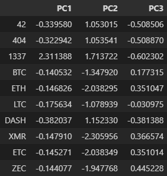
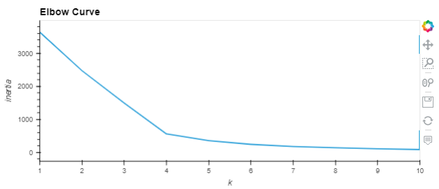
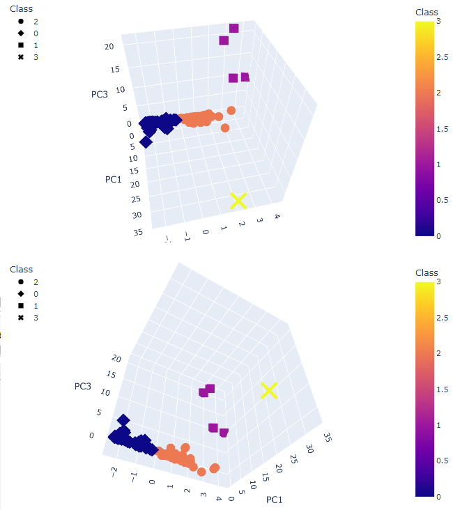
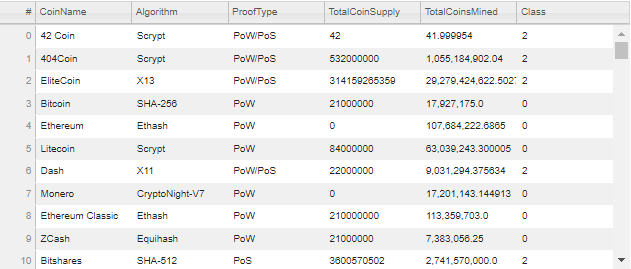
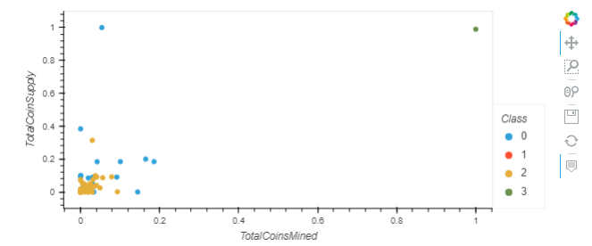

# Cryptocurrencies
### An exercise in Predictive Machine Learning for Classification
* ** 

 

## The Problem...
&nbsp;&nbsp;&nbsp;&nbsp;&nbsp;&nbsp; *"...Martha is a senior manager for the Advisory Services Team at Accountability Accounting, one of your most important clients. Accountability Accounting, a prominent investment bank, is interested in offering a new cryptocurrency investment portfolio for its customers. The company, however, is lost in the vast universe of cryptocurrencies. So, they’ve asked you to create a report that includes what cryptocurrencies are on the trading market and how they could be grouped to create a classification system for this new investment."* 
 
 
* **

## The Solution: 
 **Deliverable 1: Preprocessing**

Process the Crypto data to run Principle Component Analysis.
- The provided data is loaded into into DataFrame (**crypto_df**) and undergoes the following steps:
    - All currencies that are *not* actively traded are **discarded.**
    - All currencies *without* a working algorythm are **discarded.**
    - The "IsTrading" column is **dropped** for non-utilization.
    - All rows containing *at least 1 null value* are **discarded**. 
    - All rows *with values > 0 for the 'TotalCoinsMined' column* are ***isolated***.
    - A new DataFrame (**cc_name_df**) is created to hold *only names of resultant currencies.*
    - The "CoinName" column is then **dropped** from **crypto_df**.
    - Use get_dummies() on **crypto_df** to create variables for text features.
    - Standardize data with StandardScaler() method.
     
      

 **Deliverable 2: Reduce data demensions using PCA.**

Execution of the pca function (components = 3) results in a DataFrame with an index of Crypto names and rows holding values for Principle Components 1, 2 and 3. For more information on understanding Principle Component Analysis, follow this [link](https://towardsdatascience.com/pca-using-python-scikit-learn-e653f8989e60)
     
     
    

&nbsp;&nbsp;&nbsp;&nbsp;&nbsp;&nbsp;
 
  

**Deliverable 3: Clustering cryptocurrencies using K-Means**
- The Principle Component Analysis dataframe is used to generate an elbow curve to indicate the ideal k-value, the value at which data can be clustered and visualized most effectively. 

    
     
      

- With k-value (4) identified, the K Means clustering algorythm can begin the classification process with k clusters. The resultant cluster predictions are returned in array format and are appended to the data frame under the "Class" column with Class symbolizing the predicted cluster.
    
     For more background information on K Means Clustering, follow this [link](https://towardsdatascience.com/understanding-k-means-clustering-in-machine-learning-6a6e67336aa1)
     
      

- **Deliverable 4: Visualizing the results**
    - The Plotly Express library is used to display the ML data clusters in a 3D format.
     
      

    
     
    
    Each data point has a *'hover'* functionality that displays each data point's corresponding information when hovered over.
     
     

    - The data collected from the Predictive Unsupervised Machine Learning model was joined to the data in Del. 3, and is visualized in an hvplot table for display. (Note the addition of a "Class" column.)
     
      

    
     
     

    - The final visualization is a 2D Scatter Plot of the results from hvplot. Class is denoted by color in the legend to the right of the graph.
     
      

    
     
     

